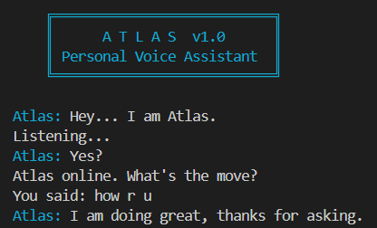
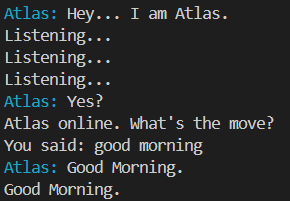

<div align="center">

# Atlas — Voice Assistant

A wake-word activated Python voice assistant with website automation, Wikipedia lookups, and local music playback — built entirely from scratch, no cloud dashboard required.


<a href="https://arnavverma18.github.io/atlas-assistant/">
  
</a>
<br>

## What it does

Atlas listens for a spoken wake word, transcribes what you say, and routes it through a command engine — no account, no cloud dashboard, everything runs locally.

<table>
  <tr>
    <td></td>
    <td></td>
  </tr>
  <tr>
    <td align="center"><sub>Wake word detected — Atlas responds</sub></td>
    <td align="center"><sub>Processing a live command</sub></td>
  </tr>
</table>

<br>

## Features

- **Wake-word activation** — stays silent until addressed directly by name
- **Website launcher** — opens Google, YouTube, Instagram, and more on command
- **Wikipedia lookups** — ask "who is..." or "what is..." for a spoken summary, with disambiguation handling for ambiguous queries
- **Local music playback** — plays songs from a personal library by voice
- **Built-in personality** — jokes, identity questions, and casual conversation
- **Natural voice output** — powered by Google Text-to-Speech (gTTS)
- **Time-aware greetings** — responds to "good morning," "good evening," and "good night"

<br>

## How it works

Atlas runs a continuous listening loop:

1. **Waits for the wake word** — listens quietly, checking short audio snippets against the activation phrase
2. **Captures the command** — once activated, opens a longer listening window and transcribes what's said
3. **Routes the request** — matches the transcribed text against a command chain: site launching, Wikipedia, music, or a built-in response
4. **Speaks the result** — converts the response to speech and plays it back, ready for the next command

<br>

## Tech stack

`Python` · `speech_recognition` · `gTTS` · `pygame` · `wikipedia` · `requests` · `python-dotenv` · `colorama`

<br>

## Example commands

| Command | Action |
|---|---|
| `atlas` | Activates the assistant |
| `open google` | Opens Google |
| `open youtube` | Opens YouTube |
| `who is [person]` | Reads a Wikipedia summary aloud |
| `play [song name]` | Plays from the local music library |
| `tell me a joke` | Tells a joke |
| `good morning` | Greets you back |
| `who are you` | Introduces itself |
| `stop` | Ends the session |

<br>

## Setup

<details>
<summary><b>Click to expand full setup instructions</b></summary>

<br>

Clone the repo and install dependencies:

```bash
git clone https://github.com/ArnavVerma18/atlas-assistant.git
cd atlas-assistant
pip install -r requirements.txt
```

Create a `.env` file in the project root for any API-dependent features:

```
NEWSAPI_KEY=your_key_here
```

Run it:

```bash
python atlas.py
```

</details>

<br>

## Roadmap

- Live news headline integration via NewsAPI
- AI-powered fallback for open-ended questions
- Multi-turn conversation support (no re-activation needed for follow-ups)

<br>

## License

MIT

<br>

<div align="center">
<sub>
  
  Built by <a href="https://github.com/ArnavVerma18">Arnav Verma</a>
</sub>
</div>
